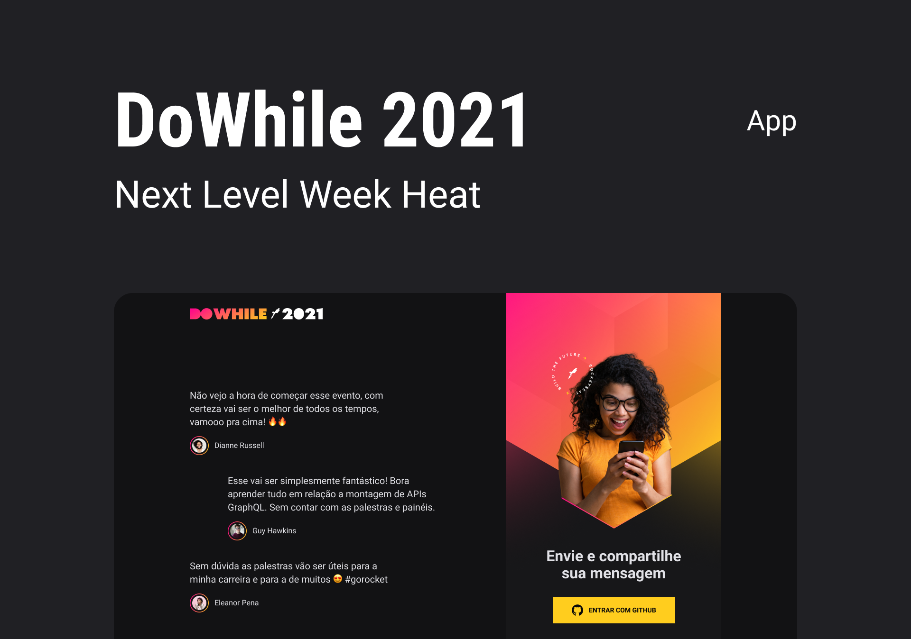

<p align="center">
  
</p>

<h1 align="center">
    
</h1>

<br>

## Tecnologias

Esse projeto foi desenvolvido com as seguintes tecnologias:

[](https://en.reactjs.org/)
[](https://socket.io/)
[](https://vitejs.dev/)
[](https://www.typescriptlang.org/)
[](https://sass-lang.com/)

## Como executar

Clone o projeto e acesse a pasta do mesmo.

```bash
$ git clone https://github.com/rocketseat-education/nlw-heat-web
$ cd nlw-heat-web
```

Para rodar em sua máquina rode:

```bash
$ yarn
# Para instalar as dependências.
```

Depois de instalar as instalar as dependências.\
Digite no terminal:

```bash
# Para iniciar o projeto
$ yarn dev
```

O app estará disponível no seu browser pelo endereço [http://localhost:3000](http://localhost:3000).

## Projeto

É uma aplicação que acontece via websocket, onde um usuário pode mandar uma mensagem e ela aparecerá em uma lista de mensagens
