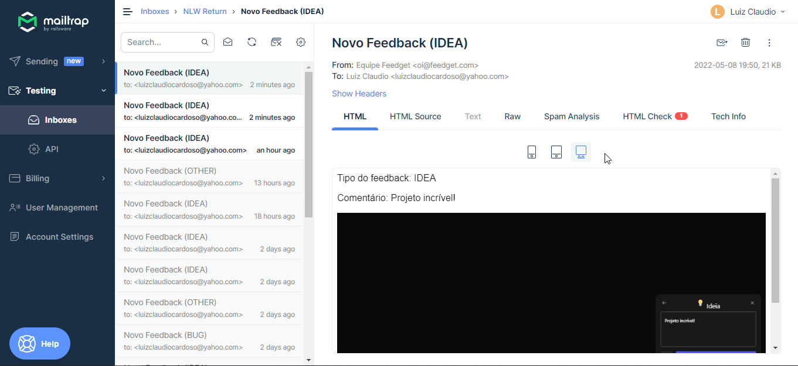

    

    

        
        
    

## ✨ Tecnologias

Esse projeto foi desenvolvido com as seguintes tecnologias:

- [Node.js](https://nodejs.org/en/)
- [Typescript](https://www.typescriptlang.org/)
- [Express](https://expressjs.com/pt-br/)
- [JSONWebToken](https://github.com/auth0/node-jsonwebtoken#readme)
- [Prisma](https://www.prisma.io)
- [Docker](https://www.docker.com/)

## 🚀 Como executar

- Clone o repositório
- Preencha o arquivo `.env.example` com os dados que deseja, depois o renomeie para `.env`
- Rode `yarn` para baixar as dependências
- Rode `docker-compose up --build -V` para fazer o docker rodar todos os apps e banco de dados Postgres
- Por fim, a aplicação estará disponível em `http://localhost:3000`

---

Feito com 💜 &nbsp;by Rocketseat 👋🏻 &nbsp;[Participe da comunidade!](https://discord.gg/gKUVrzrPrU)
