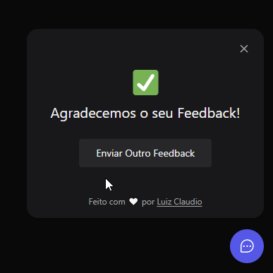

<h1> Projeto Next Level Week 8 - Return </h1>

<a title="NLW-Return" >
    

        
    

</a>

## Fotos da aplicação:

    <h3>Web APP:</h3>
    
    

        
        
        
        
    

## Tecnologias Utilizadas:

* ReactJS
* Typescript
* NodeJS
* TailwindCSS
* Headless UI > acessibilidade
* html2canvas
* phosphor-react

### Iniciar Front-end
  * ``yarn dev``
