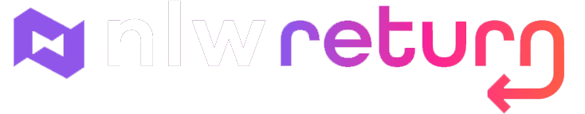
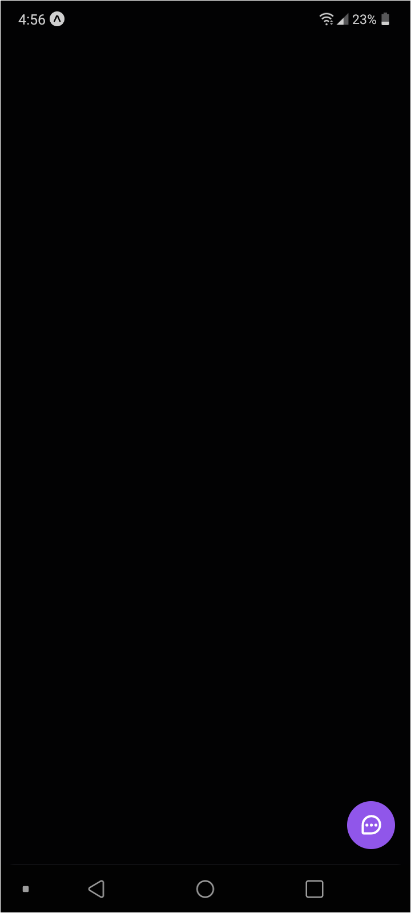
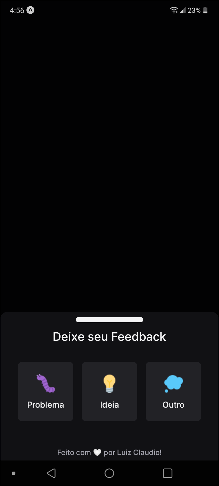
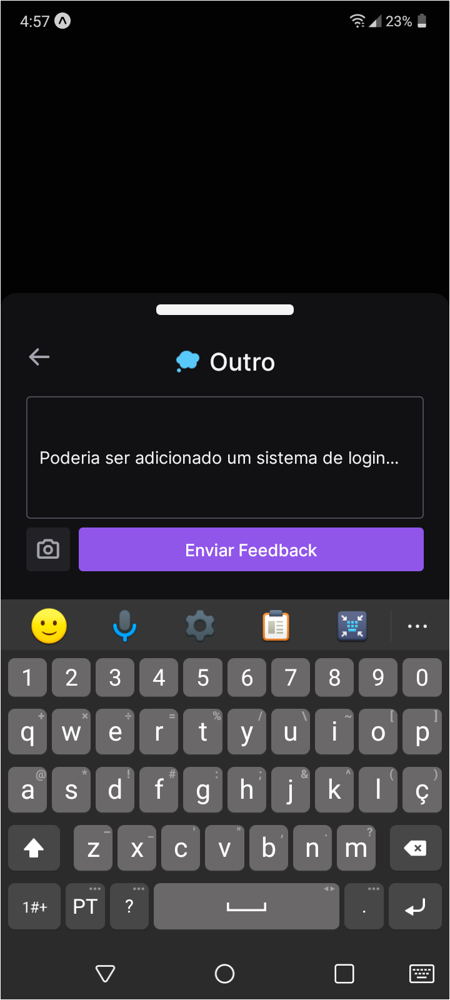
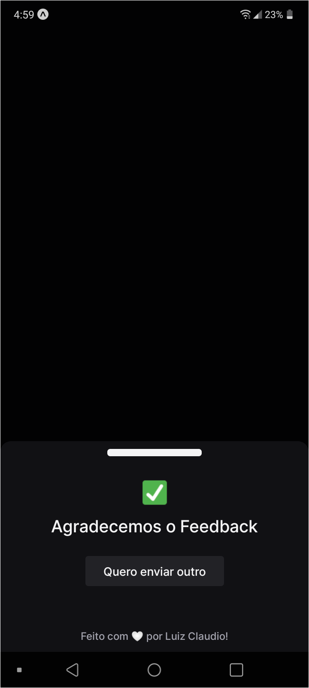

<h1> Projeto Next Level Week 8 - Return </h1>

<a title="NLW-Return" >
    

        
    

</a>

## Fotos da aplicação:

    <h3>Mobile APP:</h3>
    

        
        
        
        
    

## Tecnologias Utilizadas:

- Typescript
- NodeJS
- TailwindCSS
- Headless UI > acessibilidade
- html2canvas
- phosphor-react
- React Native
- ExpoGo

### Iniciar Mobile

- Mudar o baseURL no `src/lib/api` para seu ipv4
- `expo start`
- Acesse pelo aplicativo [Expo Go](https://expo.dev/client)
