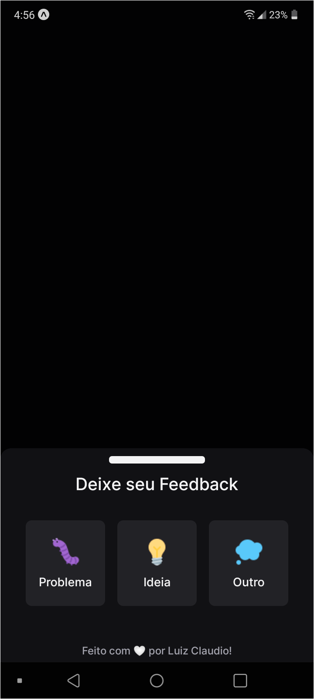
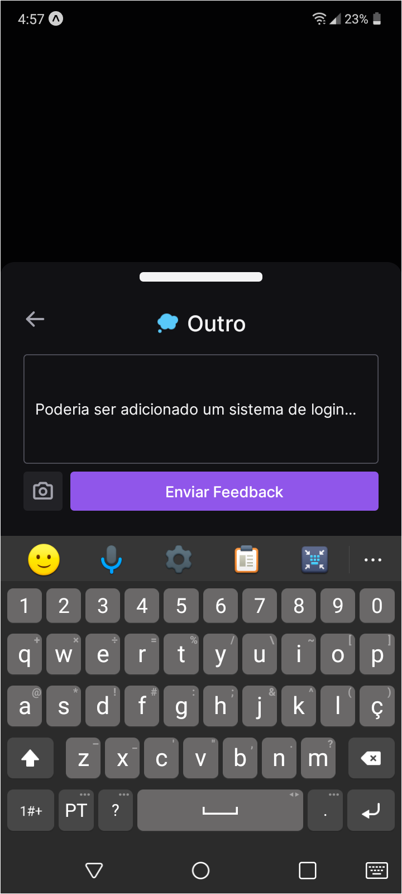
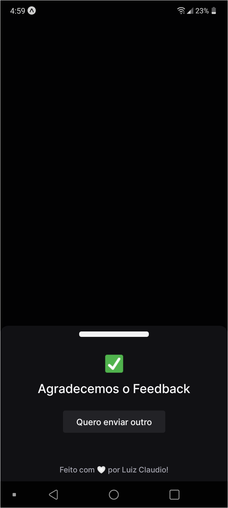

<h1> Projeto Next Level Week 8 - Return </h1>
 
<a href="" title="NLW-Return" >
    

        
    

</a>

O Projeto da **[Next Level Week](https://nextlevelweek.com/)** Desta semana é um widget de enviar feedback para os usuários enviarem suas opinioes e relatar problemas ao navegar em seu site! evento oferecido pela **[@Rocketseat](https://github.com/Rocketseat)**
 
Neste projeto o usuário escolhe um tipo de feedback a ser enviado, depois disto é inserido uma descrição ao feedback e opcionalmente a foto junto com o feedback a ser enviado, após enviar o feedback será registrado no banco de dados e será enviado um Email ao proprietário da aplicação
 
 
## Fotos da aplicação:
 

    <h3>Web APP:</h3>
    
    

        
        
        
        
    

    

    <h3>Server (Database | Email):</h3>
    

        
        
    

    

    <h3>Mobile APP:</h3>
    

        
        
        
        
    
  
    

 
 
