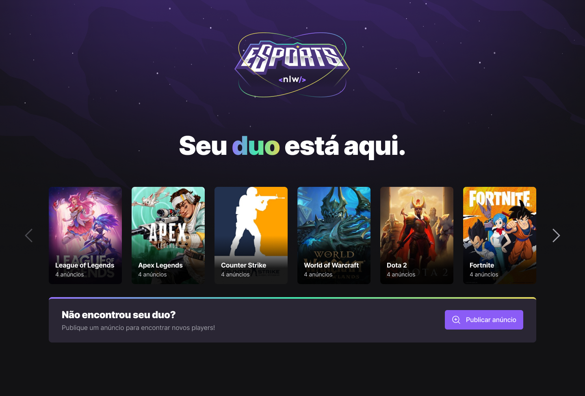
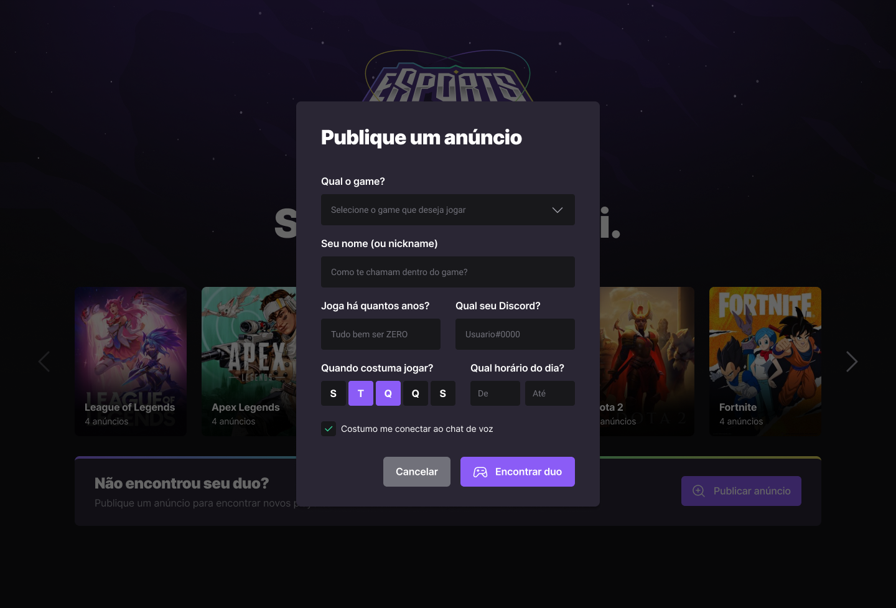
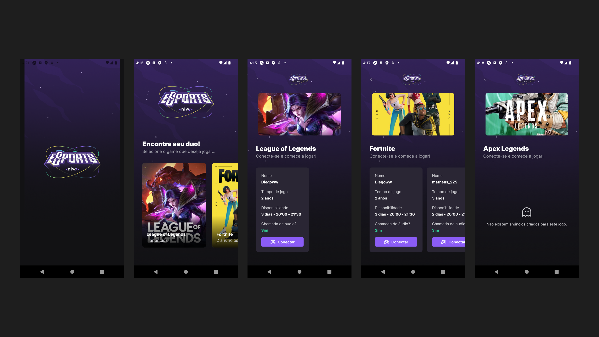

<div align="center">
   
</div>
<br/>
<div align="center">
   <a href="https://github.com/Drack112">
      
   </a>
   
   
   <a href="https://github.com/Drack112/Next-Level-Week/commits/main">
      
   </a>
   <a href="https://github.com/Drack112/Next-Level-Week/issues">
      
   </a>
   <a href="https://github.com/Drack112/Next-Level-Week/pulls">
      
   </a>
   <a href="https://github.com/Drack112/Next-Level-Week/blob/main/LICENSE.md">
      
   </a>
   </br>
   </br>
   <a href="#-tecnologias-utilizadas">
      
      
      
      
      
      
      
      
   </a>
</div>

</br>
<div align="center">

[**Sobre**](#-sobre) &nbsp;&nbsp;**|**&nbsp;&nbsp;
[**Features**](#-features) &nbsp;&nbsp;**|**&nbsp;&nbsp;
[**Tecnologias e ferramentas utilizadas**](#-tecnologias-e-ferramentas-utilizadas) &nbsp;&nbsp;**|**&nbsp;&nbsp;
[**Layout**](#-layout) &nbsp;&nbsp;**|**&nbsp;&nbsp;
[**Instalação e execução**](#-instalação-e-execução) &nbsp;&nbsp;**|**&nbsp;&nbsp;
[**Como contribuir**](#-como-contribuir) &nbsp;&nbsp;**|**&nbsp;&nbsp;

</div>

## 📃 Sobre



<br/>

**NLW eSports** é o projeto desenvolvido durante a trilha Ignite da **Next Level Week**, um evento online produzido pela [**Rocketseat**](https://github.com/Rocketseat).

Trata-se de uma landing page que permite os usuários buscarem seu duo (dupla) em jogos online e publicar um anúncio para encontrar outros jogadores no jogo que desejar.
<br/>
<br/>


Na versão mobile, são exibidos os anúncios dos jogadores para os jogos cadastrados, e os usuários terão a possibilidade de se conectarem pelo discord para jogarem juntos.



## ✨ Features

- [x] Listagem de games (web e mobile)
- [x] Criação de um novo anúncio (web)
- [x] Validações de formulário com o Formik e Yup (web)
- [x] Combobox autocomplete com lista de games para seleção (web)
- [x] Design totalmente responsivo (web)
- [x] Feedbacks para o usuário: loading durante criação, toast de sucesso e erro (web)
- [x] Listagem de anúncios (mobile)
- [x] Copiar o usuário do discord para a área de transferência (mobile)
- [x] Recebendo notificações push (mobile)

## 🚀 Tecnologias e ferramentas utilizadas

<table>
   <tbody>
      <tr>
         <td style="font-weight: bold">Front-end (web)</td>
         <td>
         <a href="https://reactjs.org/" target="_blank" rel="noopener noreferrer">React</a>,
         <a href="https://www.typescriptlang.org/" target="_blank" rel="noopener noreferrer">TypeScript</a>,
         <a href="https://tailwindcss.com/" target="_blank" rel="noopener noreferrer">TailwindCSS</a>,
         <a href="https://vitejs.dev/" target="_blank" rel="noopener noreferrer">Vite</a>,
         <a href="https://www.radix-ui.com/" target="_blank" rel="noopener noreferrer">RadixUI</a>,
         <a href="https://formik.org/" target="_blank" rel="noopener noreferrer" >Formik</a>,
         <a href="https://www.npmjs.com/package/yup" target="_blank" rel="noopener noreferrer" >Yup</a>,
         <a href="https://react-hot-toast.com/" target="_blank" rel="noopener noreferrer" >React Hot Toast</a>,
         <a href="https://phosphoricons.com/" target="_blank" rel="noopener noreferrer" >Phosphor Icons</a>
         </td>
      </tr>
      <tr>
         <td style="font-weight: bold">Mobile</td>
         <td>
          <a href="https://reactnative.dev/" target="_blank" rel="noopener noreferrer">React Native</a> e
          <a href="https://expo.dev/" target="_blank" rel="noopener noreferrer">Expo</a>
         </td>
      </tr>
      <tr>
         <td style="font-weight: bold">Back-end</td>
         <td>
          <a href="https://nodejs.org/en/" target="_blank" rel="noopener noreferrer">NodeJs</a>
         e
             <a href="https://www.prisma.io/" target="_blank" rel="noopener noreferrer">Prisma</a>
         </td>
      </tr>
   </tbody>
</table>

## 📟 Layout

O layout das telas da aplicação **NLW eSports** foi desenvolvido pela equipe da **Rocketseat** através da ferramenta [**Figma**](https://www.figma.com), um software de prototipação voltado para **UI Design (design de interfaces de usuário)**.
Você pode acessar o layout através deste link: [**NLW eSports**](https://www.figma.com/community/file/1150897317533332617).

## 🔧 Instalação e execução

Para baixar o código-fonte do projeto em sua máquina, primeiramente terá que ter instalado o [**Git**](https://git-scm.com/).

Com o Git instalado, em seu terminal execute o seguinte comando:

```bash
git clone https://github.com/Drack112/Next-Level-Week.git
```

Para instalar as dependências e executar o projeto terá que ter instalado em sua máquina o [**Node.js**](https://nodejs.org/en/), que vem acompanhado do NPM. Com ele instalado:

Navegue para as subpastas separadas para cada projeto (web/server/mobile) e rode o comando a seguir:

```bash
npm install
```

Executar o projeto web:

```bash
npm run dev

```

Executar o servidor node:

```bash
npm run dev

```

Executar o projeto mobile:

```bash
npm start

```

## 💡 Como contribuir

- Faça um **_fork_** desse repositório;
- Crie um **branch** para a sua feature: `git checkout -b minha-feature`;
- Faça um **commit** com suas alterações: `git commit -m 'feat: Minha nova feature'`;
- Faça um **push** para o seu branch: `git push origin minha-feature`;
- Faça um **pull request** com sua feature;

Pull requests são sempre bem-vindos. Em caso de dúvidas ou sugestões, crie uma _**issue**_ ou entre em contato comigo.
